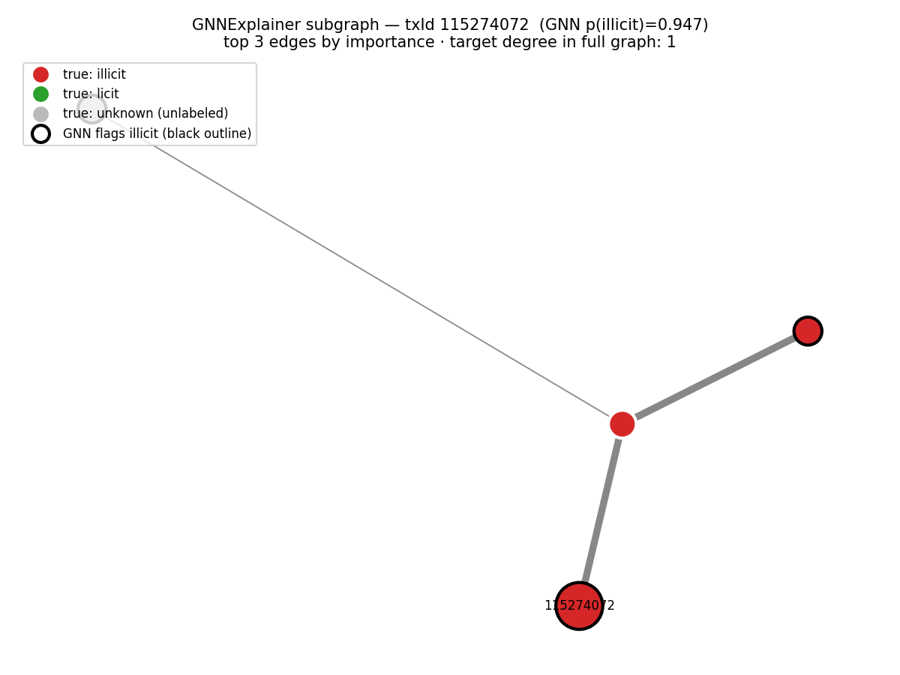
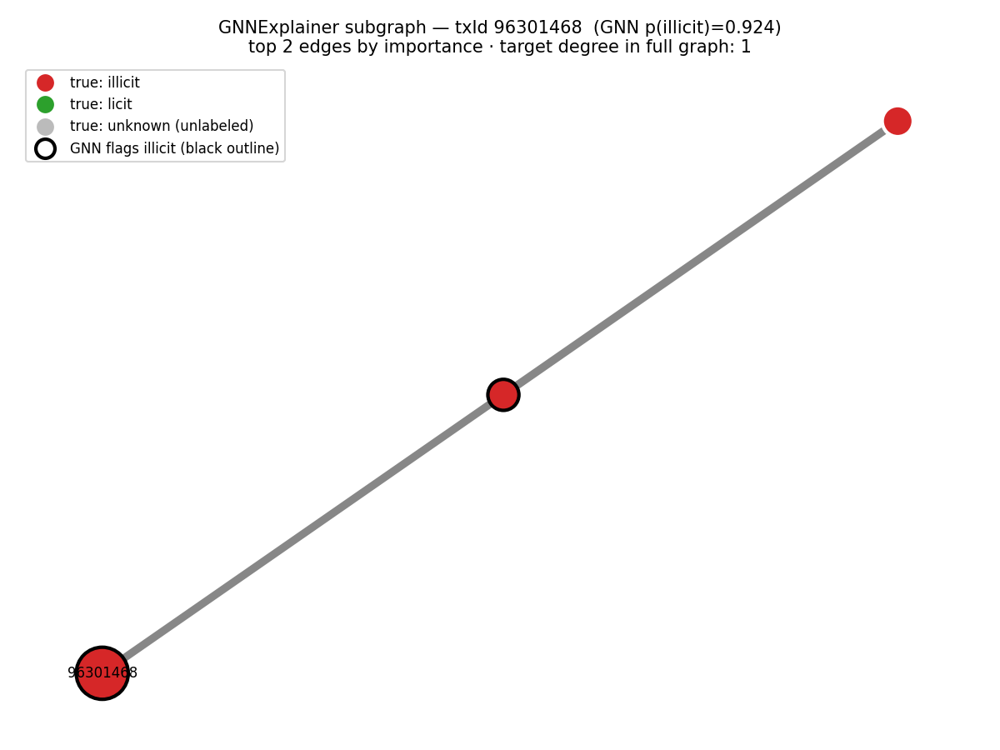
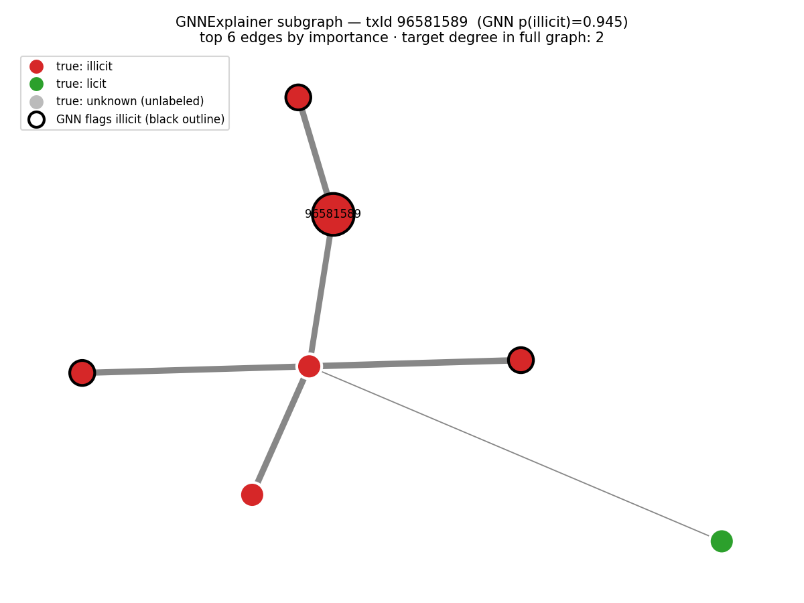
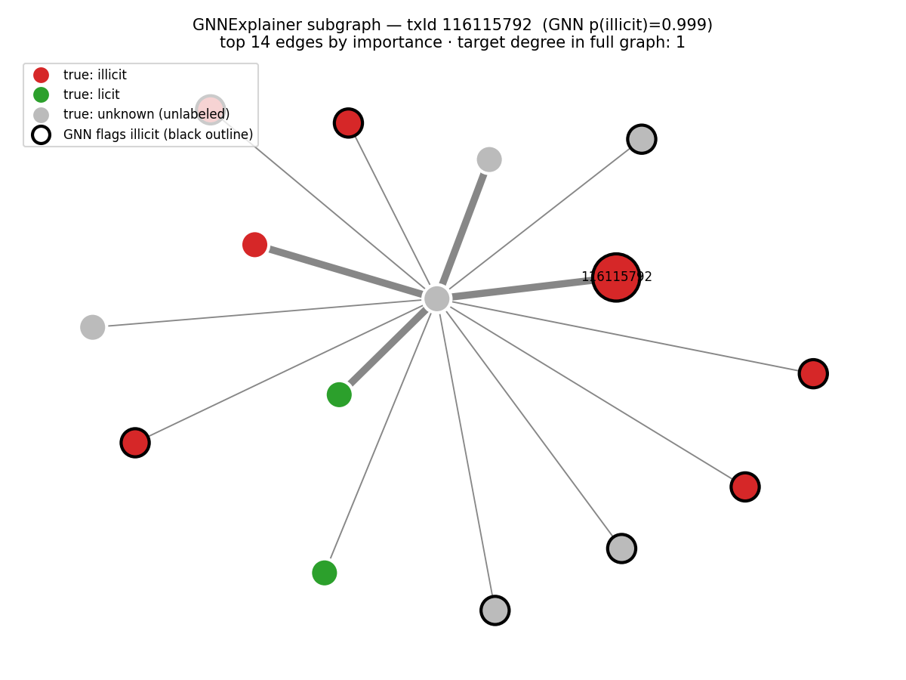
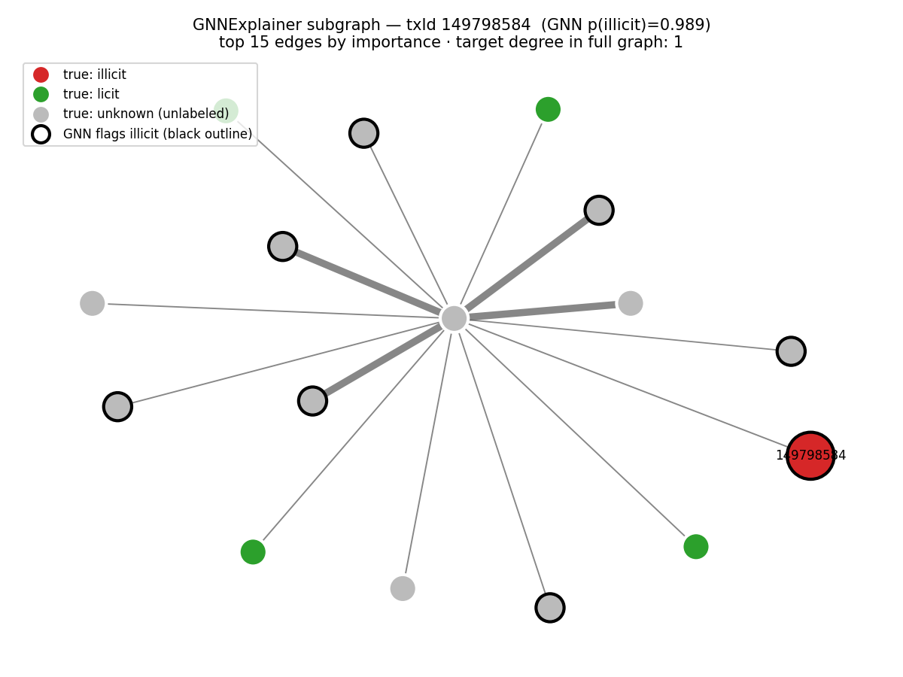
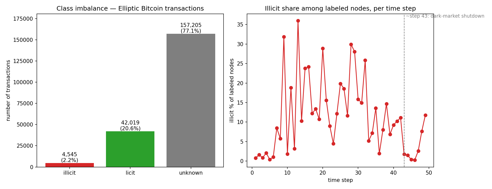

# Explainable AML Detection on the Elliptic Bitcoin Graph

Graph neural network for flagging illicit Bitcoin transactions — built to cut
false positives and explain every flag as a money-laundering typology.

## Result
- Non-graph baseline (XGBoost): flags **131 of 15,587 licit transactions as
  illicit — a 0.84% false-positive rate** on the temporal test set (steps
  35–49). Precision 0.86 / recall 0.74 / F1 0.79 on the illicit class.
- GNN (GraphSAGE): flags **327 of 15,587 licit transactions as illicit — a
  2.10% false-positive rate** on the same test set. Precision 0.68 / recall
  0.65 / F1 0.67 on the illicit class.
- Key finding: the **16 illicit transactions the GNN uniquely caught** (that
  the baseline missed) are almost all **degree-1 or degree-2 nodes** —
  unremarkable to a feature-only model, but sitting one or two hops from known
  illicit activity. The graph catches **guilt-by-association**, often through a
  short **layering** chain or a fan-out hub; XGBoost structurally cannot see it.

On raw illicit-class metrics the GNN does **not** beat the XGBoost baseline —
expected and consistent with published results on this dataset, where the
mid-timeline distribution shift makes the later test steps hard for any model.
The point of the GNN is not a higher F1; it is *what kind of pattern the graph
catches that node features alone miss* — surfaced through the explainer
subgraphs below.

Both models are trained and evaluated on the **exact same temporal split**
(29,894 labeled train nodes in steps 1–34, 16,670 labeled test nodes in steps
35–49). `gnn.py` builds the split from time steps directly rather than using
the dataset's built-in masks, so the test nodes are provably identical to
`baseline.py`. The baseline (`baseline.py`) uses node features only — no edges,
no graph structure — and is the comparison anchor for the GNN. Confusion
matrices on the test set:

XGBoost baseline:

|                  | pred licit | pred illicit |
|------------------|-----------:|-------------:|
| **true licit**   |     15,456 |          131 |
| **true illicit** |        287 |          796 |

GNN (GraphSAGE):

|                  | pred licit | pred illicit |
|------------------|-----------:|-------------:|
| **true licit**   |     15,260 |          327 |
| **true illicit** |        379 |          704 |

### What the graph catches that features miss
The two models agree far more than they disagree — but the disagreement is the
interesting part. Joining the two prediction sets on `txId` (steps 35–49):

| Disagreement set                          | Count |
|--------------------------------------------|------:|
| **GNN caught, baseline missed** (key set)  |  **16** |
| baseline caught, GNN missed                |   108 |
| both caught (overlap)                      |   688 |
| both missed                                |   271 |

The GNN is **not** a net win on raw counts — it uniquely misses more than it
uniquely catches. But the 16 it *uniquely* catches share a structure (see
*Explainer examples*): they are low-degree transactions a feature-only model
treats as ordinary, flagged by the GNN because their 2-hop neighbourhood
touches illicit activity. The graph signal is **complementary** to the
baseline, not a replacement for it.

The dataset is severely imbalanced — only
**2.23% of all transactions are labeled illicit** — and carries a known
mid-timeline distribution shift that will make the later test steps the hard
part of the problem. Details below.

## Why this framing
False positives, not accuracy, are the real cost in AML triage. Flags are mapped
to named typologies (structuring, layering, rapid movement of funds) and each
comes with an explainer subgraph — auditable, not a black box.

## Explainer examples
GNNExplainer was run on the 5 highest-confidence cases from the **key set** —
the 16 illicit transactions the GNN flagged that the XGBoost baseline missed.
Each figure shows the flagged transaction (large, labelled with its `txId`) and
the most important edges GNNExplainer surfaced; nodes are coloured by their
**true class** and GNN-flagged-illicit nodes carry a **black outline**.

The recurring structure across the key set: the flagged transaction has only
**1–2 direct edges** of its own — invisible to a feature-only model — but the
graph reaches two hops out and connects it to illicit activity.

### txId 115274072 — short illicit chain → layering

The transaction has a single edge. The explainer surfaces a short chain:
flagged tx → illicit tx → illicit tx, with two of its three neighbours
themselves labelled illicit. This reads cleanly as **layering** — a
pass-through link in a chain of illicit transactions, exactly the structure a
feature-only model cannot see.

### txId 96301468 — minimal pass-through chain → layering

The smallest case: a 3-node chain, flagged tx → illicit → illicit, both visible
neighbours illicit. Same **layering / pass-through** read as above, and the
same reason the baseline missed it — in isolation the node's own features are
unremarkable.

### txId 96581589 — edge of an illicit cluster → layering / clustered movement

The transaction has two edges; one leads into a small dense pocket where 5 of 6
visible neighbours are illicit. The flagged tx sits on the **edge of an illicit
cluster** — consistent with clustered movement of funds / layering, though the
target is peripheral to the cluster rather than central to it.

### txId 116115792 — fan-out hub → possible layering (partly circumstantial)

The transaction has one edge, to an **unlabeled intermediary that fans out to
14 other transactions** — a star / hub shape. Six of those rim nodes are
illicit and several more are independently GNN-flagged. The hub-and-spoke shape
is consistent with a one-to-many **layering** split, but because the hub itself
is unlabeled the typology read is **partly circumstantial** — the structure
supports it, the labels only partly corroborate it.

### txId 149798584 — fan-out hub, but typology unclear (honest negative)

Structurally a near-twin of the previous case: one edge into an unlabeled
intermediary that fans out to 15 transactions. But here the visible neighbours
are **0 illicit / 4 licit / 11 unknown** — no illicit corroboration in the
surfaced subgraph at all. The GNN is highly confident (p = 0.989), yet the
explainer does **not** support a clean money-laundering typology here. We
report this one as **unclear** rather than forcing a layering label onto it —
the credibility of the other four reads depends on not overclaiming this one.

## Dataset
Elliptic Bitcoin Dataset — 203,769 transactions, 234,355 directed payment
edges, 165 features, 49 time steps. Loaded via
`torch_geometric.datasets.EllipticBitcoinDataset`.

### Class imbalance (from `eda.py`)
| Class    | Count   | Share  |
|----------|---------|--------|
| illicit  | 4,545   | 2.23%  |
| licit    | 42,019  | 20.62% |
| unknown  | 157,205 | 77.15% |

Only 22.85% of nodes carry a label at all; among labeled nodes the illicit
share is 9.76%. Any baseline must be judged on illicit-class precision/recall,
not accuracy.



### Temporal structure & distribution shift
The 49 time steps are confirmed present. The standard temporal split uses
steps 1–34 for training and 35–49 for testing. There is a well-documented
distribution shift around **time step ~43** — attributed to the sudden shutdown
of a dark marketplace — after which the illicit share collapses (steps 44–46
fall to 1.51% / 0.41% / 0.28% of labeled nodes). This is a known property of
the dataset, not noise: it is why temporal splits are used and why later test
steps are expected to be hard. We do **not** model the time axis explicitly
(no temporal GNN) — we only report it so later metrics are read in context.

## Run it
```bash
# macOS only: xgboost needs the OpenMP runtime — run `brew install libomp` first
python -m venv venv && source venv/bin/activate
pip install -r requirements.txt
python eda.py        # milestone 1 — prints stats, writes figures/class_imbalance.png
python baseline.py   # milestone 2 — XGBoost baseline; writes outputs/baseline_test_predictions.csv
python gnn.py        # milestone 3 — GraphSAGE GNN; writes predictions + outputs/gnn_model.pt
python explain.py    # milestone 4 — disagreement analysis + GNNExplainer; writes figures/explain_*.png
```

All scripts are seeded (`SEED = 42`), so a clean run reproduces the numbers and
figures above. Run `gnn.py` before `explain.py` — the explainer loads the model
`gnn.py` saves to `outputs/gnn_model.pt` (gitignored; regenerable).

## Stack
PyTorch Geometric · XGBoost · GNNExplainer
